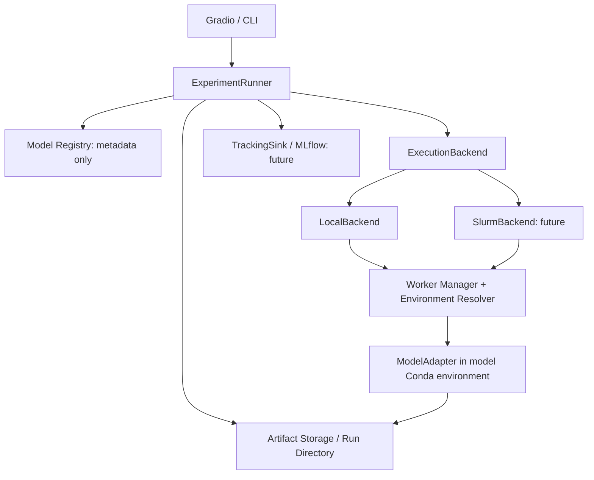

# Unified MDE / MGE Experiment Platform

複数の Monocular Depth Estimation / Monocular Geometry Estimation モデルを、
共通の入力・出力・実行契約で実行、比較、評価する研究用実験基盤を目指します。
モデル追加時に UI や実験管理を書き換えず、モデル環境の依存競合も隔離することが目的です。

Repository: [Minoru-kuma/gradio_mde](https://github.com/Minoru-kuma/gradio_mde)

## Motivation

MoGe、UniK3D、Depth Anything V3 を個別に動作させた経験を出発点にします。
過去の Gradio と Slurm の同時開発で複雑化した経験を踏まえ、まず単一モデルの
Local 実行を成立させ、UI、複数モデル、Tracking、Benchmark、Slurm を順に追加します。

## Current development status

**2026-10-07: 設計ドキュメントのみ。実行可能なアプリはこの作業環境で確認できません。**

調査対象 `/home/mizki/workdir/gradio_mde` では、文書作成前に空の `.git`、`.agents`、
`.codex`、`.aws` ディレクトリだけが見えました。ソース、依存定義、モデルスクリプトは
見えず、`git status` / `git log` は Git repository として認識されませんでした。
この結果は「可視範囲で既存コードを調査できない」ことを示し、過去のコードが
存在しないことを断定するものではありません。

Phase 00 は文書を整備しましたが、既存実装の調査・再利用判断が保留です。
Phase 01 以降は未着手・未承認です。環境作成、package install、推論、Gradio、
Slurm job、MLflow server は今回実行していません。
調査根拠と追加調査手順は [architecture](docs/architecture.md#repository-investigation) を参照してください。

## Supported / planned models

| Model | このプロジェクトでの対応状況 | 備考 |
| --- | --- | --- |
| MoGe | 計画のみ | Phase 01 の最初のモデル候補。実際の世代・checkpoint は未決定 |
| UniK3D | 計画のみ | Phase 03。非 pinhole camera と rays の扱いを含む |
| Depth Anything V3 / Depth Anything 3（DA3） | 計画のみ | Phase 03。variant と single / multi-view の能力を分ける |

上記モデルをユーザーが過去に動作させたことと、この基盤が対応済みであることは別です。
upstream の公式情報を設計参考として確認しましたが、このリポジトリ内の実行実績として
扱いません。詳細は [ModelAdapter spec](docs/model-adapter-spec.md) に記載しています。

## Architecture overview

図は将来構成の概念図です。Slurm の Worker Manager は計算ノード側で環境を解決します。
Model は「何を」、Environment は「どの依存環境で」、Backend は「どこで」、
Tracking は「どう記録」、UI は「どう操作」を担当します。
UI は Registry / Runner / 公開 backend metadata を利用し、推論の submit は Runner に集約します。

## Quick conceptual workflow

以下は設計上の手順であり、現在実行できるコマンドではありません。

1. Registry から model / variant と capability を選び、backend と実行条件を選ぶ。
2. Runner が入力を Run Directory に保存し、Run ID と JobSpec を作る。
3. ExecutionBackend が JobSpec を受け取り、対象環境の worker を起動する。
4. worker が adapter の `load()` → `predict()` → `unload()` を実行する。
5. worker が共通 result と artifacts を保存し、Runner が `collect()` して検証する。
6. UI が capability と実際の結果に応じて表示する。Phase 04 以降は Runner が MLflow に記録する。
7. Phase 05 の Benchmark は同じ single inference を画像 × モデルで反復する。

ローカルの Run Root は設定で変更可能とし、既定候補はプロジェクトルート基準の
`./runs`、環境変数は `MDE_RUN_ROOT` です。研究室の NFS path は未確認です。

## Roadmap

| Phase | 内容 | 状態 |
| --- | --- | --- |
| [00](docs/phases/phase-00.md) | Foundation / Architecture | 文書整備済み、既存実装調査保留 |
| [01](docs/phases/phase-01.md) | Single Model + Local Execution + Miniconda | 未着手 |
| [02](docs/phases/phase-02.md) | Gradio Single Model UI | 未着手 |
| [03](docs/phases/phase-03.md) | Model Plugin Architecture / Multi-model | 未着手 |
| [04](docs/phases/phase-04.md) | MLflow Tracking | 未着手 |
| [05](docs/phases/phase-05.md) | Benchmark Mode | 未着手 |
| [06](docs/phases/phase-06.md) | Execution Backend Expansion / MockSlurm | 未着手 |
| [07](docs/phases/phase-07.md) | SlurmBackend Prototype | 研究室環境確認後 |
| [08](docs/phases/phase-08.md) | Real Slurm Integration Test | 研究室実機で検証 |

Phase の完了によって次 phase を自動開始しません。管理方法は [PLANS.md](PLANS.md) に定義します。

## Documentation index

- [AGENTS.md](AGENTS.md): Codex の作業ルール
- [PLANS.md](PLANS.md): phase の承認範囲・計画・進捗管理
- [Architecture](docs/architecture.md): 調査結果、責務、依存関係、設計判断
- [ModelAdapter spec](docs/model-adapter-spec.md): ModelInfo / Capabilities / MDEOutput
- [Environment strategy](docs/environment-strategy.md): Conda、CUDA、subprocess、micromamba
- [ExecutionBackend spec](docs/execution-backend-spec.md): Job / Resource / backend 契約
- [Slurm integration](docs/slurm-integration.md): 将来の接続方式と研究室確認事項
- [MLflow design](docs/mlflow-design.md): Params / Metrics / Artifacts / Tags
- [Run Directory spec](docs/run-directory-spec.md): file protocol、Run ID、attempt、保存形式
- [Phase 00–08](docs/phases/): 各段階の tasks / tests / exit criteria
