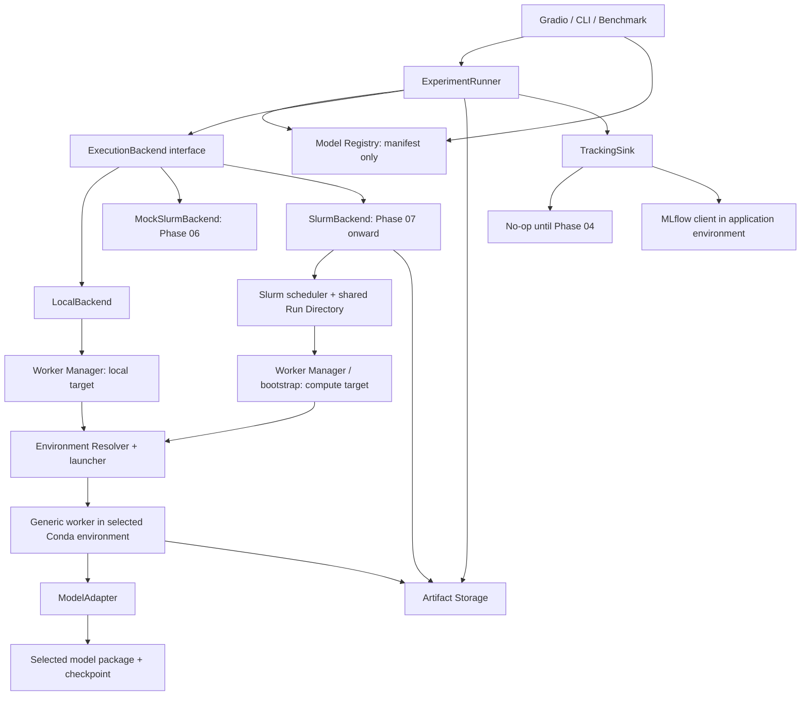

# Architecture

Status: Phase 00 COMPLETE。記載する package / interface は未実装。
clean-start を正式な出発点とし、Phase 01 の実装はまだ承認されていない。

## Repository investigation

調査日: 2026-10-07。対象: `/home/mizki/workdir/gradio_mde`。

| 調査項目 | 方法 | 確認結果 | 設計への影響 |
| --- | --- | --- | --- |
| 現在位置 / root | `pwd`、path resolve、`ls -la` | 指定 root に一致 | 別 root を対象にした調査ではない |
| 可視 directory 全体 | hidden を含む `rg --files` と recursive walk | 空の `.git` / `.agents` / `.codex` / `.aws` のみ | 既存 production file は見えない |
| 作業指示 | root と上位の AGENTS.md 探索 | 可視範囲に既存 AGENTS.md なし | 今回入口を新規作成 |
| 履歴 / 差分 | `git status --short --branch`、`git log -5 --oneline` | `not a git repository` | commit・dirty state は unknown、変更 diff を取得不可 |
| モデル / UI / Slurm | 全可視 file の確認 | 実装や起動スクリプトを確認できず | 動作済みと記載しない |
| 依存 / 環境 / tests | 同上 | pyproject / requirements / environment.yml 等なし | exact version、既存環境名、test command は未確認 |

文書作成前の可視構造:

```text
gradio_mde/
├── .git/      # 空、Git metadata を確認できない
├── .agents/   # 空
├── .codex/    # 空
└── .aws/      # 空
```

過去に 3 モデルを個別に動作させた情報、Gradio / Slurm 同時実装で複雑化した情報は
ユーザー提供の背景であり、ソースを実見した結果とは分ける。上の表は文書作成前の調査記録。
その後、ユーザー指定の GitHub repository へ Phase 00 文書を集約した。
保護された空 directory の理由、研究室への接続経路は推測しない。

### Existing-code reuse gate

2026-10-07 のユーザー決定により、source audit gate は充足した。

1. この repository 内には再利用必須の既存 production implementation は存在しない。
2. 新しい実験基盤の clean-start repository として正式に開始する。
3. 過去の MoGe / UniK3D / DA3 個別コードは repository 外の参考資料であり、
   必要に応じて Phase 01 / Phase 03 で確認する。取得・移植は Phase 00 の完了条件ではない。

参考コードを確認する際は model / checkpoint / upstream revision、Python / torch / CUDA 条件、
前後処理、depth の意味・単位、export の再利用候補を記録する。利用する処理は adapter の境界に
閉じ込め、当該環境で再検証する。参考コードをこの repository の実装済み機能や保証済み baseline
として扱わず、旧 CLI / output の移行を初回 E2E の前提にしない。

## Responsibilities and dependency rules

| Component | 責務 / 公開契約 | 依存してよい対象 | 持たない責務 |
| --- | --- | --- | --- |
| Gradio | 入力、選択、進捗、可視化、download | Registry metadata、Runner、backend catalog | model import、Conda 起動、sbatch、MLflow 記録 |
| ExperimentRunner | 検証、Run ID、入力保存、Job 作成、submit / collect、結果・評価・tracking 調整 | 共通契約、Registry、Backend、Storage、TrackingSink | torch inference、scheduler command、環境 activation |
| Model Registry | manifest 発見、ModelInfo / variant / capability / parameter schema | metadata reader、schema | adapter import、重み loading、Conda activation |
| ModelAdapter | load / predict / unload、モデル前後処理、共通出力への変換 | worker contracts、当該 upstream 依存 | Gradio、Slurm、MLflow、実行場所選択 |
| Environment Resolver | logical environment と target profile を起動情報へ解決 | EnvironmentSpec、設定、launcher | モデル inference、scheduler 状態管理 |
| Worker Manager | process 起動・監視、worker protocol とログ。終了制御は 01B、GPU lease は必要性を後で判断 | Resolver、process interface、Run Store | モデルごとの実行分岐、MLflow、UI |
| ExecutionBackend | submit / status / cancel / collect | Job 契約、Storage、実行 adapter | モデル API / preprocessing |
| LocalBackend | process handle、worker manager の呼び出し。01A は単一 subprocess、queue は後の拡張 | local Worker Manager | Runner 内への subprocess 直書き |
| SlurmBackend（将来） | scheduler / site profile、job ID、状態正規化、共有成果物回収 | Slurm command adapter、shared Store | モデル名で分岐した runner |
| Artifact Storage | Run Root、file publication、checksum、result validation / access | filesystem interface、共通契約 | モデル評価、MLflow 内部 ID の生成 |
| TrackingSink / MLflow | Runner から受け取った実験情報の記録と再送 | JobResult / provenance、MLflow client（UI 側のみ） | worker の必須依存、artifact の唯一の保存先 |

worker 用の薄い共通契約は UI / tracking / upstream package を import しない。
Runtime の array handling はモデル環境内で完結し、境界を越えるのは JSON と file reference。



矢印は操作・データの関係を表す。MLflow SDK を model worker に import する関係ではない。
Local と Slurm で同じ JobSpec / Result を使うが、環境 prefix と Run Root は実行先で解決する。
図は段階的に構築する全体像。01A は単一 manifest、薄い Runner / Store / environment launcher と
LocalBackend / worker の経路だけを実装対象とし、UI、TrackingSink、queue、plugin discovery の
汎用 framework を最初の成功条件にしない。

## Public application interfaces

UI / CLI / Benchmark は共通 application service を使う。以下は概念 signature で、未実装。

```text
Registry.list_models() -> list[ModelInfo]
Registry.get_model(model_id, variant_id) -> resolved ModelInfo
BackendCatalog.list_profiles() -> list[BackendProfileInfo]
ExperimentRunner.submit(request: RunRequest) -> RunHandle
ExperimentRunner.status(handle: RunHandle) -> RunStatus
ExperimentRunner.cancel(handle: RunHandle, reason) -> CancelReceipt
ExperimentRunner.collect(handle: RunHandle) -> RunResult
ExperimentRunner.artifacts(handle: RunHandle) -> list[ArtifactRef]
```

RunRequest はモデル / variant、logical environment の選択、backend profile、入力参照、
parameters / requested outputs / resources を持つ。Runner が検証して Run ID / JobSpec を作る。
RunHandle は run / attempt ID と永続 handle の参照であり、特定 backend の PID を UI に要求しない。
RunStatus / RunResult は JobStatus / JobResult と tracking_state / optional evaluation を包む。
UI は raw file publication や worker report を直接見て完了判定しない。
公開 artifacts は確定した selected attempt の検証済み reference とする。
BackendCatalog は利用可能な profile と準備状態の metadata を返し、UI が Backend を直接起動しない。

## Planned package topology

以下は将来の配置案。今回作成するのは Markdown 文書だけ。
01A で全 directory / service を完成させる必要はなく、責務の境界を保った最小構成から始める。

```text
src/mde/
  contracts/         # model / job / result / environment schema、版管理
  registry/          # manifest discovery、metadata validation
  runner/            # orchestration、共通 evaluation 呼び出し
  environments/      # resolver と conda / future micromamba launcher
  workers/           # generic worker、process lifecycle、serialization
  backends/          # Local と将来 plugin の共通 interface
  storage/           # RunStore、atomic publication、artifact readers
  tracking/          # NoOpTracking / MLflowTracking
  evaluation/        # 共通 metric protocol（Phase 05）
  ui/                # Gradio（Phase 02）
models/<model_name>/
  adapter.py
  manifest.json
  environment.yml
  README.md
  tests/             # model contract と shape / convention の検証
```

モデル追加は原則 `models/<model_name>/` の追加だけで行う。manifest に adapter entrypoint、
upstream / variant、capability、logical environment、params schema を宣言する。
利用者は environment provisioning を別途行う必要があり、directory を追加しただけで
GPU / dependency が準備済みになるわけではない。新しい出力種別が必要な場合だけ共通契約を
版付きで拡張する。Python packaging の具体方式は Phase 01 で最小限選定する。

## End-to-end lifecycle

1. Runner が metadata に基づき要求を検証し、immutable JobSpec と入力を Store に準備する。
2. backend が JobSpec を受理して JobHandle を返す。Runner は handle を永続化する。
3. backend 側で logical environment を実行 target の profile に解決する。
4. Worker Manager が共通 worker を起動する。worker だけが adapter entrypoint を import する。
5. worker は version / input / environment を確認し、load → predict → serialize → unload を行う。
6. result manifest を最後に atomic publish する。backend は process / scheduler と manifest の
   両方を確認し、契約上の成功を判定する。
7. Runner は collect 結果を検証し、表示・共通評価・tracking に渡す。
   UI が閉じても保存結果を再収集できる。

Phase 01 の worker は原則 1 job / 1 process。01A は利用者が単一 job を起動する最小経路とし、
GPU lease / queue / concurrency 制御を要求しない。cancel / timeout と同一 Backend instance の
二重起動拒否は 01B、高度な retry / reconciliation / application restart recovery は Phase 06 以降。
GPU lease の必要性も実際の競合要件を確認して後で判断する。warm worker pool、job arrays、
並列評価は後の拡張。上の lifecycle にある tracking / 再収集も各 milestone の範囲で追加する。

## UI and benchmark contracts

UI は capability の `supported / conditional / unsupported` と実際の artifact の有無を見て
depth / points / normals / intrinsics / rays / pose / confidence を表示する。
parameter controls は manifest の schema から生成し、モデル名による callback 分岐を増やさない。
計測値は worker の実測値と Runner の経過時間を区別し、未測定値は unavailable と表示する。

BenchmarkCoordinator（Phase 05）は image × model × config を複数の通常 JobSpec に展開し、
同じ Runner / backend / adapter を通す。共通 Evaluator が raw depth を評価し、
比較条件・失敗数・skip 理由を保存する。可視化 PNG を深度評価の入力にしない。

## Architecture decisions

| ID | Decision | Reason | Trade-off | Future extension |
| --- | --- | --- | --- | --- |
| A01 | Model / Environment / Backend を別識別子にする | モデル × 実行先の直交性を保つ | 設定の参照解決が必要 | 同一 model を Local / Slurm で実行 |
| A02 | Registry は metadata だけを読む | UI 環境へ torch 等を持ち込まない | runtime capability を worker で再確認する | directory discovery / package entrypoint |
| A03 | Phase 01 から subprocess worker | Python / torch / CUDA runtime を隔離 | 起動と serialization の費用 | pool / persistent worker を protocol の上に追加 |
| A04 | JSON + file artifacts の Run protocol | Local / NFS と別環境で同じ契約 | 小さな対話 RPC より遅い | optional streaming progress、Store backend |
| A05 | local Run Store を一次記録にする | Tracking 障害で成果を失わない | MLflow に複製・再送が必要 | remote artifact service / policy-based retention |
| A06 | metric / relative と camera convention を明示 | 不公平な評価と幾何変換の誤りを避ける | adapter の変換責務が増える | rays / multi-view / 新 camera model |
| A07 | 初期モデルは MoGe を候補とし未確定 | ユーザーの動作経験を優先する | 01A 開始時に upstream / checkpoint / 環境 pin の選定が必要 | 実機成功後に検証済み条件を保存 |
| A08 | Slurm は contract と確認表まで | 現地仕様・アクセスが不明 | 現地まで実機保証できない | 07 / 08 の site plugin と integration test |
| A09 | 今後導入する interface / 保存形式の互換性を維持 | clean-start 後に蓄積する実験結果を読めるようにする | schema reader / 移行手順の維持 | deprecation を明示し major schema で変更 |
| A10 | clean-start、外部の過去コードは必要時の参考資料 | repository 内に再利用必須実装がないとユーザーが確認 | 既存実装への適合や旧 baseline は保証しない | 01 / 03 で参考処理を adapter 内へ接続 |
| A11 | Phase 01 を最小 E2E の 01A と基本堅牢化の 01B に分ける | まず 1 model / 1 image の実推論を成立させる | 01A 単独では cancel / timeout / 復旧を保証しない | 共通契約を維持して 01B / 06 / Slurm へ拡張 |

## Open decisions

初期 model / checkpoint / upstream revision、Python / torch / CUDA build、
UI package pin、GPU 性能、GT dataset / evaluation protocol、MLflow version / URI、
研究室設定は未確定。各仕様・phase に判断時点を割り当て、値を仮定してコード化しない。
外部の過去コードの所在・利用可否は、参考資料が必要になった 01 / 03 で確認する。
