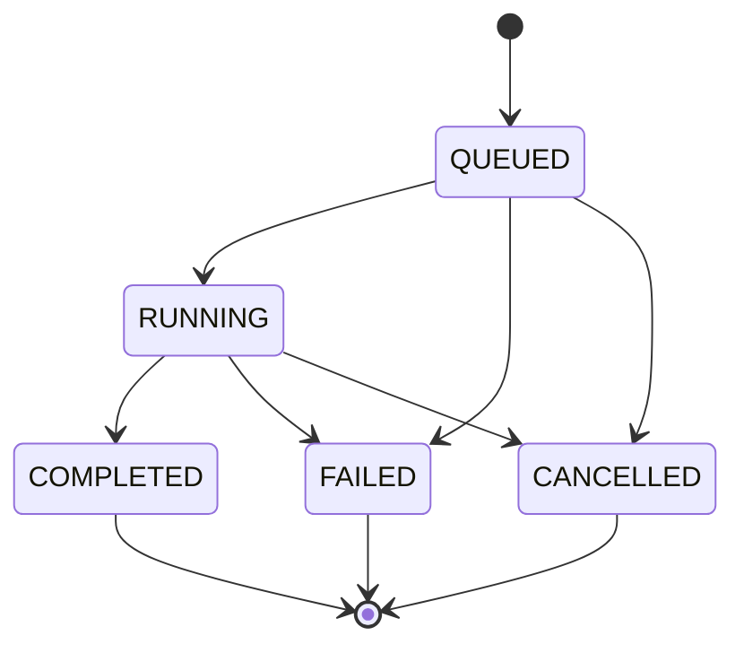

# Execution backend specification

Status: 未実装の共通契約。初期運用は LocalBackend のみ。
関連: [Architecture](architecture.md)、[Environment](environment-strategy.md)、
[Run Directory](run-directory-spec.md)、[Slurm](slurm-integration.md)。

## Orthogonal model / environment / backend

Job は `model_ref`、`environment_ref`、`backend_id` を独立に持つ。
ModelAdapter に scheduler command、Backend にモデル loading API を書かない。

| Model | EnvironmentRef の例 | Backend の選択 |
| --- | --- | --- |
| MoGe | `mde-moge` の定義参照 | Local / 将来 Slurm |
| UniK3D | `mde-unik3d` の定義参照 | Local / 将来 Slurm |
| DA3 | `mde-da3` の定義参照 | Local / 将来 Slurm |

名前は logical ID の例。環境 prefix は実行 target で解決する。同一の model contract を使い、
`MoGeSlurmRunner` のような model × backend 専用クラスを作らない。
backend を変えた比較実行は provenance を分けるため新しい Run ID とする。

## ExecutionBackend interface

signature は概念仕様。concrete class / function はまだ作成しない。
以下は最終的な共通契約。01A の最小実装と 01B / 06 の追加範囲を
[Phase 01](phases/phase-01.md) と本書の LocalBackend 節で区別する。

```text
submit(spec: JobSpec) -> JobHandle
status(handle: JobHandle) -> JobStatusSnapshot
cancel(handle: JobHandle, reason: str | None) -> CancelReceipt
collect(handle: JobHandle) -> JobResult
```

| Operation | 契約 |
| --- | --- |
| `submit` | 非同期に受理する。戻り値は推論完了ではない。schema / reference / resource を検証し handle を保存する |
| `status` | 非破壊の観測。backend raw state と正規化状態、観測時刻を返す。通信障害で FAILED を捏造しない |
| `cancel` | 対応 backend は冪等な終了要求を返す。受理と実際の CANCELLED を分け、process / scheduler 確認まで terminal としない。未対応は明示エラー |
| `collect` | terminal Job の共通結果と artifact refs を返す。再呼び出し可能で artifact を移動・削除しない |

非 terminal の collect は `ResultNotReady`、不明 handle は `UnknownJob`、schema 不一致は
`UnsupportedSchema` 等の明示エラーにする。poll timeout は job 実行 timeout と区別する。
FAILED / CANCELLED でも診断情報を collect できる。collect はモデルを再実行しない。
01A は interface の signature を保ちつつ `supports_cancel=false` を公開し、cancel 呼び出しは
`UnsupportedOperation` とする。未対応操作を成功扱いしない。execution timeout 対応も 01B に
追加し、01A で walltime を指定された場合は unsupported resource として submit 前に拒否する。

## Common types

### JobSpec

`schema_version = "1.0"` を初期案とする JSON document。作成後は immutable。

| Field | 定義 |
| --- | --- |
| `run_id`, `attempt_id`, `attempt_number` | logical experiment と実行 attempt。初回は `attempt-0001` |
| `idempotency_key`, `request_digest` | submission 同一性と immutable inference request の hash |
| `created_at`, `parent_run_id` | UTC timestamp、任意 benchmark 親 run |
| `model_ref` | model / variant ID、adapter / upstream revision、checkpoint revision / digest |
| `environment_ref` | logical environment ID、定義 digest、protocol version |
| `backend_id`, `backend_profile` | 実行先と site profile の識別子。研究室値は未設定 |
| `inputs` | view ID、Run 相対 path、image hash、任意 camera reference |
| `inference` | device / dtype、seed、resolution policy、model parameters、requested outputs |
| `resources` | ResourceSpec |
| `storage` | Run relative location / Store reference。実機 absolute root は対象側で解決 |
| `evaluation` | optional 共通 EvaluationSpec 参照。推論 worker は GT 評価を担当しない |
| `provenance` | git commit / dirty / source identity、requester、protocol revision |

checkpoint の未知 revision は unknown と明示する。初期実機 acceptance では検証した版を確定する。
JobSpec に shell command、torch tensor、MLflow client、host 固有 prefix を入れない。
backend 専用 partition / account 等は backend profile に置き、model metadata から切り離す。

### ResourceSpec

| Field | 意味 / 単位 |
| --- | --- |
| `cpu_count` | 正整数、初期は単一 worker task の CPU 数 |
| `gpu_count` | 非負整数、Phase 01 は 0 または 1。分散推論は対象外 |
| `gpu_type` | optional GPU の要求クラス。site mapping が必要 |
| `host_memory_mib` | optional host memory 要求、MiB |
| `gpu_memory_mib` | optional GPU memory 要求 / admission hint、MiB。強制 quota ではない |
| `walltime_seconds` | optional execution timeout、秒。queue wait と分ける |

未指定と 0 を区別し、不可な組合せは submit 前に拒否する。要求値と実割当てを別記録する。
Local で scheduler 相当の memory enforcement を保証できない項目は best-effort と明示する。
GPU type を Slurm GRES にどう対応させるかは site profile を確認するまで決めない。

### JobHandle

`schema_version`、`run_id`、`attempt_id`、`backend_id`、opaque `backend_job_id`、
`submission_time`、`idempotency_key`、Run relative location、backend profile ID を持つ。
Local PID だけを永続 identity にしない。process start identity / manager instance を別 metadata に
持たせ、PID 再利用を区別する。Slurm job ID は backend_job_id として保存する。
保存形式は読み戻せる JSON とし、MLflow run ID を job handle に代用しない。
handle の保存は 01A から行うが、application 再起動後の active job の監視・停止・復旧を
01A の保証に含めない。高度な recovery / reconciliation は Phase 06 以降に検証する。

### JobStatus and JobStatusSnapshot

共通 lifecycle states（01A で queue 管理や cancel 対応を全て実装することは意味しない）:

| Status | 意味 |
| --- | --- |
| `QUEUED` | 受理済み、まだ worker を実行していない |
| `RUNNING` | worker / scheduler が実行中。結果 publication 中も含める |
| `COMPLETED` | execution 成功と result / 必須 artifact の契約検証が完了 |
| `FAILED` | 実行失敗、timeout、OOM、成功後の result 欠落 / 破損等が確定 |
| `CANCELLED` | cancellation による停止を backend が確認 |

Snapshot は `status`、`last_known_status`、`backend_state`、`observed_at`、`sequence`、
`started_at`、`finished_at`、`cancel_requested`、`reason`、diagnostics を持つ。
観測不能時は補助状態 `UNKNOWN` と last_known を返す。UNKNOWN は実行状態の逆戻りではない。
query 失敗と worker 失敗、job 不在と未登録 handle を区別する。



terminal state は immutable。poll の遅い古い観測で戻さない。retry は terminal → QUEUED の
状態変更ではなく、新しい attempt と handle で表す。
collect 時点の artifact 検証に通るまでは COMPLETED としない。確定後に artifact が外部変更された場合は
run 結果を改変せず `ArtifactIntegrityError` として報告する。

### JobResult

`schema_version`、run / attempt / backend IDs、terminal status、timestamps、
`outputs: list[SerializedMDEOutput]`、artifact refs、metrics、actual execution metadata、
warnings、error を持つ。成功時は少なくとも 1 view の depth が必要。

worker の `output/<attempt_id>/result.json` は WorkerResult report であり、execution 全体の
確定結果と区別する。Backend は worker report と process / scheduler 情報を照合して JobResult を作り、
`attempts/<attempt_id>/job-result.json` に保存する。worker が起動しなかった失敗でも backend が
outputs 空の診断結果を生成できる。FAILED の途中 artifact は partial と示し成功出力と混ぜない。

error は code、stage（preflight / load / predict / serialize / backend / collect）、message、
retryability、exit code / signal、traceback artifact ref。native exception class をプロセス越しに渡さない。
metrics は units と measurement scope を伴い、未計測を 0 として補完しない。

## LocalBackend

### Phase 01A — Minimum Local E2E

1. 単一 Job を検証・受理・記録し、worker を起動して JobHandle を返す。
   QUEUED は起動までの状態として使えるが、待ち行列や GPU lease を作らない。
2. 薄い Worker Manager / launcher が target profile から 1 つの selected environment を解決する。
3. 共通 worker を argv により起動し、stdout / stderr を attempt 別に保存する。
4. status で process を観測し、exit code と WorkerResult / 必須 depth・metadata の基本検証で
   terminal を確定する。collect は保存済み JobResult / artifacts を返す。

利用者が 1 job を起動する運用を前提とし、他 process との GPU 調停や並列 submit の保証はしない。
cancel / execution timeout は未対応として明示する。自動 retry は 0、active job の restart recovery
は対象外。Runner / Gradio が直接 subprocess を呼ぶ経路は作らず、backend 境界は最初から保つ。

### Phase 01B — Local robustness

cancel / timeout は process group に終了を要求し、必要に応じて grace period 後に強制終了する。
Conda wrapper と子 worker の終了を確認してから terminal とする。同一 Backend instance の
実行中の追加 submit は busy として拒否し、単純な二重起動を防ぐ。queue や分散 lease は導入しない。
欠落 / 破損 artifacts、繰り返し collect、異常終了を検証し、基本 timing / allocator memory と
環境の再現手順を整える。保存済み terminal result の再読込と active job の復旧は区別する。

高度な retry / submission reconciliation / application restart recovery / concurrency 制御は
Phase 06 以降。GPU lease はその必要性と scope を改めて判断する。
OS 強制 quota・複数 host 調停・worker pool は Phase 01 の保証範囲外。

## Future SlurmBackend

same JobSpec → site resource mapping → generic worker job → same JobResult とする。
環境は計算 target で解決し、共有 Store を介して inputs / report / logs を交換する。
sbatch / squeue / sacct / scancel の違いはこの backend と command adapter に閉じ込める。
研究室固有実装は [Phase 07](phases/phase-07.md) で設定確認後に行う。

## MockSlurmBackend / fake backend

Phase 01 の fake backend は Runner の契約検証用。Phase 06 の MockSlurmBackend は、
clock / executor / command adapter を注入して以下をローカルで再現する。

- QUEUED → RUNNING → COMPLETED / FAILED / CANCELLED。
- queue cancel、running cancel、completion と cancel の競合。
- 一時 UNKNOWN、遅延 status、結果 publication 遅延、破損 / 欠落。
- submit の応答喪失、同じ key の再 submit、重複 collect、process / client 再起動。
- NFS を模した遅延・partial read・stale observation。

実時間の長い sleep や本物の sbatch を必要としない。Mock 成功は実際の Slurm / NFS の保証ではない。

## Failure, cancellation and retry contracts

以下は段階的に検証する契約。01A は基本失敗判定と保存・同一実行中の submission 同一性を扱い、
cancel / timeout は 01B、応答喪失・再起動をまたぐ照合や高度な retry は 06 以降とする。
新 attempt を作れる schema を先に定義しても、retry controller を 01A に実装する必要はない。

- idempotency は run / attempt / request digest で判断する。同じ key の受理済み submit は同じ
  handle を返す。異なる spec に同じ key を使う場合は conflict。
- submit が受理されたか不明なときは `SubmissionUncertain` と記録する。既存 job を照合する前に
  retry して二重実行しない。backend が無条件 exactly-once を保証するとはしない。
- cancel 受理後も worker が終了するまで RUNNING / QUEUED と cancel_requested を保持する。
  成功が先に確定した Job は COMPLETED のまま。cancel 失敗を CANCELLED に見せない。
- execution timeout は FAILED とし、code を TIMEOUT とする。ユーザー cancel は CANCELLED。
- 初期の自動 retry 回数は **0**。schema / dependency / checkpoint / OOM の失敗を盲目的に retry しない。
- 指示された retry は同じ inference request の新 attempt を作り、旧 artifact / handle を保持する。
  model / parameters / environment / backend / resources を変える場合は別 Run ID と `retry_of_run_id`。
- preemption / node failure に限定した bounded retry は Phase 07–08 で policy を確認して追加する。

## Decisions

| Decision | Reason | Trade-off | Future extension |
| --- | --- | --- | --- |
| すべての Local 実行も backend interface 経由 | 実行場所の後付け refactor を避ける | 最初から handle / poll が必要 | Slurm / 別 scheduler plugin |
| backend 状態と worker report の両方を確認 | exit 0 / scheduler COMPLETED だけでは成果物を保証できない | publication grace と validation が必要 | integrity / remote Store |
| UNKNOWN は観測の補助状態 | 通信障害で実行結果を誤判定しない | UI に未確定表示が必要 | reconciliation / controller recovery |
| retry を別 attempt とする | 失敗の証拠と測定 provenance を保持 | Run Directory が増える | bounded transient retry / scheduler requeue |
