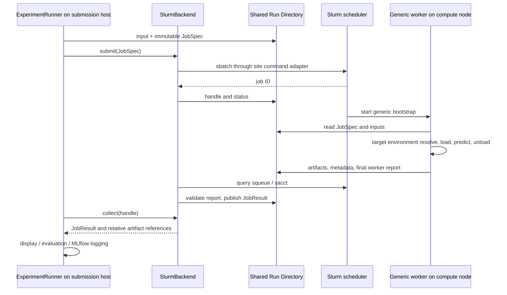

# Future Slurm integration

Status: **将来設計のみ。研究室固有の Slurm 実装・job script・接続・投入は行わない。**
現時点では自宅から直接アクセスできず、研究室で環境を確認する必要がある。
NFS 共有 storage はユーザー情報では存在する可能性が高いが、実在・mount・権限は未確認。
関連: [Backend contracts](execution-backend-spec.md)、[Run Directory](run-directory-spec.md)、
[Phase 07](phases/phase-07.md)、[Phase 08](phases/phase-08.md)。

## Required site investigation

| 確認事項 | 現状 | 現地で確認する内容 |
| --- | --- | --- |
| Slurm version / enabled features | unknown | CLI 版、parser の利用可能な output format、accounting |
| partition / account / QOS | unknown | 利用許可、default、time / resource limits |
| GPU resource / GRES | unknown | GPU type 表記、GPU 数指定、GPU binding、MIG の有無 |
| sbatch policy | unknown | script policy、requeue、module、environment export、job arrays |
| shared filesystem / NFS | 未確認 | login / compute 双方の mount、path mapping、read/write、quota |
| Miniconda / environment 配置 | unknown | shared prefix / node-local prefix、起動可能な launcher path |
| module system | unknown | module initialisation、必要 module、noninteractive shell |
| node 外部ネットワーク | unknown | checkpoint / pip 等への到達、offline cache の要否 |
| CUDA / NVIDIA driver / GPU | unknown | node 型ごとの driver / runtime 互換性、device visibility |
| squeue / sacct / cancellation | unknown | accounting delay / retention、job visibility、scancel 権限 |
| 実行場所・接続方式 | unknown | 研究室 login host で Runner を使うか、許可された remote adapter か |

値は現地で取得した証拠・日時・確認者を付け site profile と運用文書に記録する。
hostname、partition、GRES、NFS path、Miniconda path を仮定して設定ファイルを完成させない。
SSH / VPN / remote submit を現在使えるものとして実装しない。

## Shared Run Directory approach

最初の prototype は、submission host と compute node が同じ Run を読める filesystem を条件とする。
確認できない場合は共有型 prototype を開始せず、staging / transport を別計画として設計し直す。

payload は Run 相対 path を使う。node 上の prefix / root は target site profile で解決する。
model worker は JobSpec のモデル entrypoint を呼ぶ共通 worker であり、model 名ごとの sbatch template を
量産しない。MLflow 通信は submission 側 Runner が担当し、node から tracking server 到達を必須にしない。

## Scheduler command boundary

| Command | Backend 内の用途 | 確認・注意 |
| --- | --- | --- |
| `sbatch` | generic bootstrap の submit と job ID 取得 | exit code と parseable ID を保存。対応形式は version 確認後に選ぶ |
| `squeue` | queue / running 等の現在状態 | 一覧から消えたことだけで成功としない |
| `sacct` | 終了状態・exit code 等の accounting 確認 | 有効性、遅延、job / batch / step 行の区別を現地確認 |
| `scancel` | job ID に対する cancellation request | command 成功と Job の停止確認を分ける |

submit で得る job ID はモデルではなく Backend が保持する。
parseable output が使える場合も cluster suffix、stderr warning 等を正常 ID と混同しない。
command adapter は argv / stdout / stderr / exit code を抽象化し、Mock で置換できるようにする。
長い sbatch call と status poll に timeout を設け、submission acknowledgement が不明なケースを残す。

command の標準動作は
[sbatch](https://slurm.schedmd.com/sbatch.html)、
[squeue](https://slurm.schedmd.com/squeue.html)、
[sacct](https://slurm.schedmd.com/sacct.html)、
[scancel](https://slurm.schedmd.com/scancel.html) の公式仕様を参考にする。
これらの web 文書の版が研究室の installed version と一致するとは限らない。

## Job lifecycle and state normalization

以下は標準 Slurm 状態に対する設計上の mapping 案。raw state を必ず保持する。

| Slurm raw state の例 | Common observation | 成果物の扱い |
| --- | --- | --- |
| PENDING | QUEUED | report がないことは正常 |
| RUNNING / COMPLETING | RUNNING | publication 中はまだ成功としない |
| COMPLETED | report 検証後 COMPLETED | exit、ID、必須 depth、checksum の確認が必要 |
| FAILED / TIMEOUT / OUT_OF_MEMORY / NODE_FAIL | FAILED | error code と partial logs を保持 |
| CANCELLED | CANCELLED | cancellation が確認された結果 |
| PREEMPTED / REQUEUED / SUSPENDED / 未知状態 | policy により未確定 / UNKNOWN | cluster policy と restart 情報を確認して判定 |

Slurm 状態と flag は [公式 Job State Codes](https://slurm.schedmd.com/job_state_codes.html) を確認する。
mapping は scheduler plugin の責務。adapter に Slurm enum を渡さない。
一時 query failure や accounting visibility delay は UNKNOWN / last_known で保持し、FAILED にしない。

COMPLETED と出力の可視性が食い違う場合は bounded publication grace を使う。
grace 後も report 不在なら `MISSING_RESULT`、破損なら `INVALID_RESULT` として FAILED を確定する。
grace の長さは NFS / accounting の測定後に設定する。無期限に待つ設計にはしない。

## ResourceSpec mapping

mapping は site profile の検証済みルールに閉じ込める。

| Common requirement | Slurm mapping の候補 | 現時点の決定 |
| --- | --- | --- |
| cpu_count | 単一 task の CPU request | exact flag / policy は現地確認 |
| gpu_count / gpu_type | GPU / GRES request | GRES か GPUs 系か、type 名は未決定 |
| host_memory_mib | memory request | 単位、per-job / per-CPU 方針を確認 |
| gpu_memory_mib | GPU type / admission hint | scheduler が直接 quota を保証すると仮定しない |
| walltime_seconds | time limit | partition 上限と丸めを検証 |
| backend profile | partition / account / QOS 等 | 実在する値を確認してから設定 |

初期 prototype は single-node、single-task、single-GPU を目標とする。multi-node は別 scope。
要求条件と実際の node / GPU / allocation を別 metadata に保存する。
Slurm の device visibility を尊重し、physical GPU ID を model-specific code に埋め込まない。

## Logs, environments and storage

- stdout / stderr は Run の `logs/<attempt_id>/` に保存する方針。scheduler の filename substitution を
  使う場合は site の対応を確認する。application の Run ID / attempt / job ID を照合可能にする。
- worker の実際の node name、GPU、driver、runtime、allocated resource を report に含める。
- module bootstrap と environment resolution は compute target の設定に従う。interactive shell の
  `.bashrc` / `conda activate` が batch job でも動くと仮定しない。
- prefix の shared 使用、node-local staging、weight cache、offline install は現地調査後に決める。
- NFS の権限、rename / read visibility、容量、同時 write、cleanup を試験する。
  process / file lock が全 node で同じ意味を持つと仮定しない。

## Failure handling, cancellation and retry

submit error、submit outcome 不明、環境起動失敗、checkpoint 不在、OOM、timeout、node failure、
NFS write failure、report corruption、tracking outage を別 error code / stage で残す。
worker が開始しない場合も Backend の診断 JobResult と scheduler log を collect 可能にする。

cancel は `scancel` を発行した後に scheduler の停止を確認する。通信障害中は cancel_requested と
last_known を保持する。終了済み成功 Job の cancel は no-op とし、COMPLETED を書き換えない。
User cancel と timeout / preemption を区別して結果を記録する。

prototype の自動 retry は 0。transient node failure / preemption の bounded retry は policy の
確認後に optional として追加し、max attempts / backoff / eligible errors を明示する。
同じ request の application retry は新 attempt / 新 handle とし、旧 logs / output を保持する。
不明 submission を job name / comment 等の利用可能な identity で reconcile するまで再投入しない。

Slurm native requeue では同じ scheduler ID で worker が再起動することがあるため、application retry と
区別する。対応する場合は scheduler restart count / execution instance を保存し、旧成果物を上書きしない。
その contract と site policy が確認できるまで requeue 前提の運用は exit 対象に含めない。

## Prototype / real test gates

Phase 06: Mock が状態・取消・出力遅延・parser fixture を扱える。
Phase 07: site 確認表、接続方式、共有 root、environment、command output、resource mapping を確定し、
最小 prototype を作る。利用可能なら許可された小さい smoke job を行い、実機未実施は明記する。
Phase 08: 実モデル、NFS、状態観測、failure / cancel、artifact collection、MLflow の往復を現地で検証する。

## Decisions

| Decision | Reason | Trade-off | Future extension |
| --- | --- | --- | --- |
| shared Run Directory を最初の transport 候補にする | compute node から application service を直接呼ばない | filesystem の相互到達が前提 | staging / remote storage backend |
| cluster 値を未確定の site profile とする | 研究室の実設定を推測しない | 現地確認まで prototype を完成できない | 複数 partition / cluster profile |
| squeue と accounting / report を照合 | queue から消失した job を成功扱いしない | accounting delay の処理が必要 | reconciliation / requeue |
| retry を初期 disabled とする | 重複 submit と OOM 無限再試行を避ける | transient failure も最初は手動対応 | bounded retry policy |
